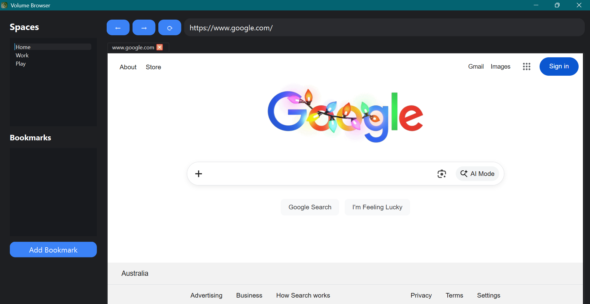

# Volume Browser

> A lightweight, minimalistic, and modern web browser built with **Python** and **PyQt6**.  
> Each Latitude has its own tabs and bookmarks, making it perfect for organization and productivity.

---

## Features

- ✅ Lightweight & fast
- ✅ Multiple **Latitudes** (Home, Work, Play) with independent tabs
- ✅ Bookmark management per Latitude
- ✅ Add new tabs with a single click
- ✅ Navigate with Back, Forward, Reload buttons
- ✅ URL bar with search fallback
- ✅ Clean, modern interface with dark theme
- 🟡 Tab deletion coming soon!

---

## Screenshots

---

## Installation
- Find Releases and download the latest installer

## Environment
- Our browser uses 0% carbon*

## Developers

